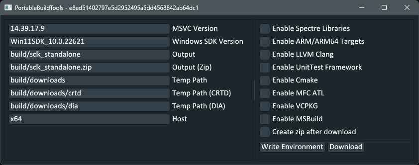

# PortableBuildTools
Create standalone instances of VS Build Tools.

> [!Warning]
> #### Under Development
> ###### There is no stable version.

## Privacy
`modmanager` is an open source project. Your commit credentials as author of a commit will be visible by anyone. Please make sure you understand this before submitting a PR.
Feel free to use a "fake" username and email on your commits by using the following commands:
```bash
git config --local user.name "USERNAME"
git config --local user.email "USERNAME@SOMETHING.com"
```

## Requirements (Building)
- Go 1.22 or later.
- Rust 1.78 or later.
- GCC 14.2.0 or later.
- GNU Make 4.4.1 or later.

### Requirements (Development)
- All of the above requirements.
- golangci-lint 
    - `go install github.com/golangci/golangci-lint/cmd/golangci-lint@latest` or `v1.61.0`
- gofumpt
    - `go install mvdan.cc/gofumpt@latest`
- Optionally: deadcode
    - `go install golang.org/x/tools/cmd/deadcode@latest`

## Building
- Run `make all`. Output is located in `build/`
    - Optionally: run `make syso` first if you have `windres` in your PATH.
- Run `portablebuildtools.exe` found under `build/`.
    - Use `portablebuildtools -h` to view a list of commands.



## Usage (CLI)
- Run `portablebuildtools.exe` after building to download the default packages.
    - ARM/ARM64 targets can be downloaded by appending the `--arm-targets` flag.
    - Spectre libraries can be downloaded by appending the `--spectre-libs` flag.
    - LLVM Clang can be downloaded by appending the `--llvm-clang` flag.
    - UnitTest framework can be downloaded by appending the `--unittest` flag.
    - Cmake can be downloaded by appending the `--cmake` flag.
    - MFC/ATL libraries can be downloaded by appending the `--mfc-atl` flag.

## Registering (Experimental)
- Modify `_Instances/state.json` paths to match the download location. Modify additional files and values as needed.
- Run `vs_register.bat`
- Run `vswhere.exe` to check if your instance is registered.

## Testing
Rudimentary testing is located in `tests/*`
- After downloading the standalone SDK, run the tests via `build_win.bat`.
- View dumpbin header information to ensure the executables were built with the correct architecture.
- ARM and ARM64 targets have not been extensively tested on any substantial projects and may not function correctly.

## Information
- The default download options include (almost) everything you need to build and run the majority of C/C++ applications and libraries.
- Use [session.log](./session.log) to view all files downloaded with the `microsoft.vc.{msvc_ver}, microsoft.visualcpp, microsoft.vs, microsoft.visualstudio` prefixes.
- A modified version of ([MSIExtract](https://github.com/Super-Pizza/MSIExtract)) is used over options such as `msiexec` or `lessmsi` due to issues with how arguments and spaces in paths are handled with the alternatives.

### Alternatives
- `winlibs-mingw` [brechtsanders/winlibs_mingw](https://github.com/brechtsanders/winlibs_mingw/releases)
- `llvm-mingw` [mstorsjo/llvm-mingw](https://github.com/mstorsjo/llvm-mingw)
- `llvm-clang` [llvm-clang](https://releases.llvm.org/download.html)

### Tools
- `dumpbin /headers example.dll`
- `corflags example.dll`

## Platforms

|        | Windows|Linux (Untested)|Mac OS (Untested)|
|--------|--------|----------------|-----------------|
| x86-64 | ✅ | ❌ | ❌ |
| x86    | ❌ | ❌ | ❌ |
| ARM64  | ❌ | ❌ | ❌ |

## Contribution Guidelines
If you would like to contribute to `PortableBuildTools` please take the time to carefully read the guidelines below.

### Commit Workflow
- Run `make lint` and ensure ALL diagnostics are fixed.
- Run `make fmt` to ensure consistent formatting.
- Create concise, descriptive commit messages to summarize your changes.
    - Optionally: use `git cz` with the [Commitizen CLI](https://github.com/commitizen/cz-cli#conventional-commit-messages-as-a-global-utility) to prepare commit messages.
- Provide *at least* one short sentence or paragraph in your commit message body to describe your thought process for the changes being committed.

### Pull Requests (PRs) should only contain one feature or fix.
It is very difficult to review pull requests which touch multiple unrelated features and parts of the codebase.

Please do not submit pull requests like this; you will be asked to separate them into smaller PRs that deal only with one feature or bug fix at a time.

### Codebase refactors must have prior approval.
Refactors to the structure of the codebase are not taken lightly and require prior discussion and approval.

Please do not start refactoring the codebase with the expectation of having your changes integrated until you receive an explicit approval or a request to do so.

Similarly, when implementing features and bug fixes, please stick to the structure of the codebase as much as possible and do not take this as an opportunity to do some "refactoring along the way".

It is extremely difficult to review PRs for features and bug fixes if they are lost in sweeping changes to the structure of the codebase.

# License
See [LICENSE](./LICENSE) file.

See [LICENSE-MSIExtract](./LICENSE-MSIExtract) file.